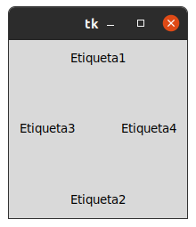
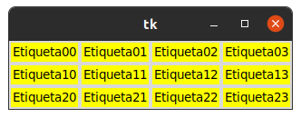
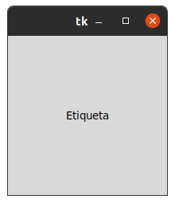

# 1. POSICIONAMIENTO Y DISEÑO 

## GESTOR DE GEOMETRIA PACK

### Este gestor de geometria distribuye los widgets en horizontal o envertical .

## Gestor de geometria Grid 

### Con grid la distribuccion de los widgets se realiza de una manera mas flexible utilizando un diseño cuadricula. De esta manera , cada widget en la celda determinada por la interseccion de una fila y una columna.

## Gestor de geometria pleace 

### Este gestor permite colocar los widgets en cooordenadas especificas de la ventana principal o del widget contenedor.

