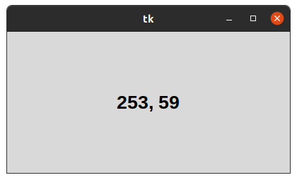
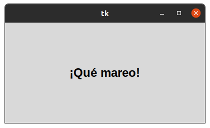

## 2. METODOS COMUNES 

## POSICION DE RATON 
### Este programa nos ayuda a saber la posicion exacta en donde se encuentra ubicado el cursor del mouse .

## DELETREO
### Este programa consiste en completar la frase tkinter en cada una de las celdas en las que rota la celda de manera aleatoria para volverla entretenida .

## TEMPORIZADORES
### En este programa se puede apreciar como hace zoom y como disminuye de manera continua hasta no cerrar la ventana .

