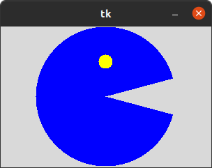
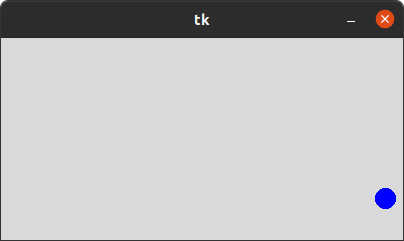
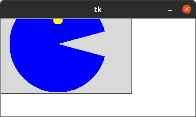
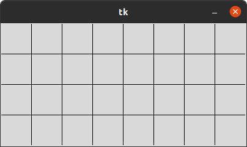
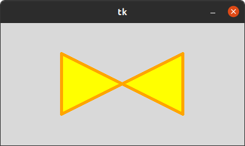
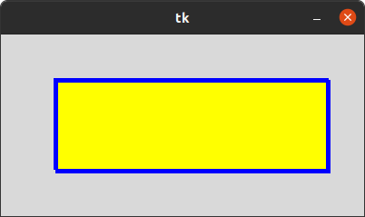
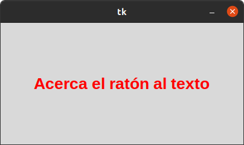
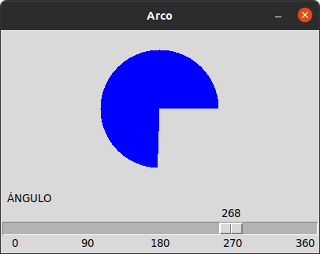

# 5. CANVAS

## ARCO
### Este programa nos muestra como diseñar la animacion de cosas dentro de la ven tana tkinter en este caso nos muestra la animacion de packman .

## CIRCULO
### Este codigo nos muestra como una bolita rebota entre las paredes de la ventana en la que se ejecuta , al verlo durante mucho tiempo nos puede marear .

## IMAGEN
### Este programa consiste en el mismo codigo anterior con el cambio de que la bola azul cambia por una imagen la cuel esta insertada en el codigo .

## LINEAS 
### En este programa se puede apreciar Como con el codigo se forman lineas horizontales y verticales que hacen un tipo de cuadricula . 

## POLIGONO
### Con este codigo se forman figuras en la figura insertada en el codigo se forma un corbatin .

## RECTANGULO
### Al entrar nos muestra la figura quee hallamos insertado en el codigo .

## TEXT
### En este programa se puede ver quen al acercar el mouse el color del texto cambia , el color se puede cambiar desde el cogido igual que el texto que se encuentra dentro de el .

## SCALE
### Este programa consiste en mover control que se encuentra situado en la parte baja para mostrar el angulo exacto que se desea ,

