# 4. WIDGETS

## TIEMPO
### Este codigo consiste en un cronometro el cual se inicializa y se pausa con las variables "Def star" y la variable "Def stop" .

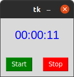

## RELOJ
### Este codigo se basa en un reloj el cual muestra la hora en tiempo real, su parte funcional es "time.strftime" la cual hace que se muestre la hora exacta .

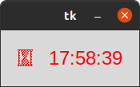

## MENU
### Es un menu principal el cual puede ser de gran utilidad para el desarrollo de una aplicacion de escritorio.

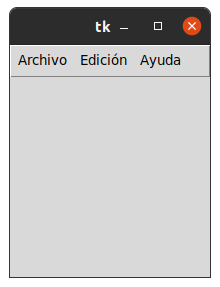

## BOX
### Es un menu igual al anterior con la diferencia de que hay unos comandos nuevos los cuales son como mas funciones .

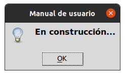

## ARCO
### En este programa se encuentra una nueva funcion la cual es "Canvas.pack" la cual da relleno y color a la figura , es basicamente un creador de angulos exacto .

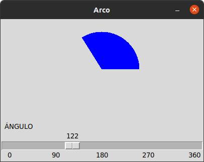

## FORMULARIO
### Es un programa el cual se basa en un formulario que nos pide datos personales basicos para guardarlos .

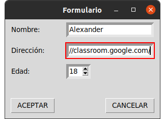

## VENTANA DE ACCESO 
### Es una ventana la cual cumple con la funcion de una pestaña de registro , tambien puede ser de gran utilidad para el desarrollo de una Ap .

## LOGIN
### Es una pestaña la cual nos pide usuario y contraseña para acceder , demasiado util para una pagina la cual requiera un  registro 

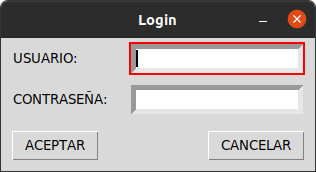

## IDIOMA
### Es un programa el cual nos ayuda a cambiar de idioma el texto ingresado en elñ codigo similar a un traductor .

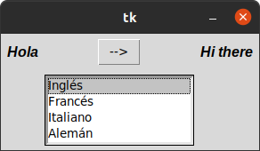

## FORMULARIO V.2
### Este es un programa similar al anterior en donde se implementas nuevas opcion como la eleccion de genero.

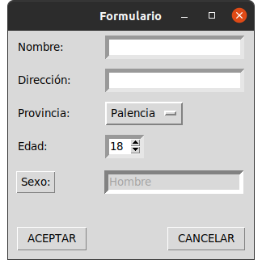

## OPTION MENU
### Formulario en el cual se guardan los datos ingresados y al aceptar muestra nuestras respuetas dadas en el formulario .

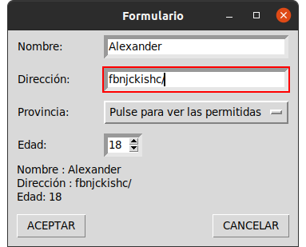

## SCROLL
### Este programa consiste en ayudar al usuario para guardar sus archivos y cosas personales en dichas carpetas

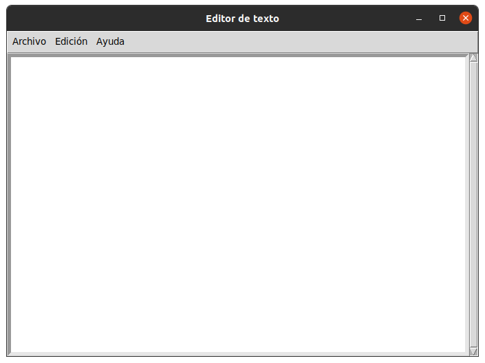

## TEXT
### Nos permite escribir cualquier frase y guardarla en la caarpeta que se desee .

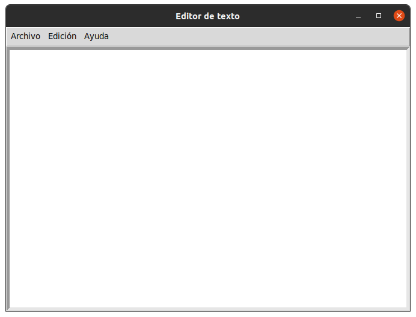